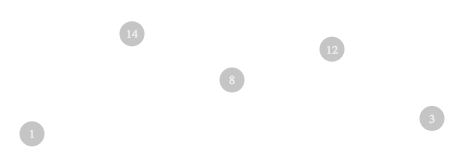

# Learning Objectives (2/2)

- Create an object literal with properties and methods
- Define encapsulation
- Create a function that returns an object literal
- Create an object using a constructor function
- Create a prototype for an object
- Define methods on an object prototype
- Differentiate between prototype methods and methods on the constructor
- Inherit prototypes
- Create an es6 class
- Create a constructor method for an es6 class
- Create an instance method
- Create a static method
- Identify some use cases for a es6 class or es5 constructor function


## prereqs
- familiarity with JS object literals
- familiarity with JS functions

# Framing (1/3)

Objects are great. They store information that we can pass around, manipulate, aggregate and all sorts of other things. There are several ways to create and leverage objects in javascript. This workshop will dive into some of those ways.

# The Object Literal (3/6)

The object literal is a versatile tool we can use to package some data together.

Here's an example:

```js
const person = {
  name: 'bob',
  greet: () => {
    console.log('hello, my name is bob');
  },
};
```

Neat, in just 6 lines of code We've got an object that not only has a property... but also a method!

Suppose we need to create two instances of the same type of object. We could do something like this:

```js
const person = {
  name: 'bob',
  greet: () => {
    console.log('hello, my name is bob');
  },
};

const person2 = {
  name: 'mary',
  greet: () => {
    console.log('hello, my name is mary');
  },
};
```

## Discussion - (3/9)

- What are some issues with creating two "people" objects in this way?
- What are some different approaches to writing the previous code?

# Encapsulation - A reason for object types (1/10)
There are lots of reason why me might want to define a type of object. Encapsulation is probably at the top of the list. [Eloquent Javascript](https://eloquentjavascript.net/06_object.html) says it well here:

>The core idea in object-oriented programming is to divide programs into smaller pieces and make each piece responsible for managing its own state.

# Another approach - A regular 'ol function(4/14)

Going back to the `person1` and `person2` code. We could potentially write it like this.

```js
function createPerson(name){
  return {
    name,
    greet() {
      console.log(`hello, my name is ${this.name}`)
    },
  };
};

const person = createPerson('bob');
const person2 = createPerson('mary');
```

It's certainly a lot better and now we have a way to create as many people as we want. But we have a issue where we create a `greet` method for every instance of a person. What if the business partner wants greet to say something different? Now it needs to be changed in the `createPerson` function and then all the people need to be recreated. Not only that, we are still creating a greet method for each individual person.

# A better approach - Constructor Functions and Prototypes (16/30)

In javascript all objects have a prototype property.

MDN really says it best [here](https://developer.mozilla.org/en-US/docs/Learn/JavaScript/Objects/Object_prototypes):

> Well, to be exact, the properties and methods are defined on the prototype property on Objects' constructor functions, not the object instances themselves. In JavaScript, a link is made between the object instance and its prototype (its __proto__ property, which is derived from the prototype property on the constructor), and the properties and methods are found by walking up the chain of prototypes.

Let's take a simple `String` method used in javascript: `split`.

```js
const name = 'Mary, Bob, Sue';
const nameArray = name.split(', ');
console.log(nameArray);
// nameArray returns ['Mary', 'Bob', 'Sue']
```

Sometimes, we as developers use tools like this and never really question why we're even able to. We're able to call the `split` method  on any string because `split` is defined on the `prototype` of the `String` type. We can see all the methods available to any value in js by accessing the `__proto__` property

But just like any method or function we use, it's specifically defined somewhere. The differences between the `greet` function we've written versus the `split` function defined natively is not too disparate apart from their functionalities.

## The constructor function

Turns out, javascript has given us a way of defining a type of object and methods for those objects. In order to even use a prototype we must first create a constructor function.  Constructor functions allow us to create object types in javascript. They are much like classes in other languages.

```js
function Person(name) {
  this.name = name
  this.greet = () => {
    console.log(`hello, my name is ${this.name}`)
  }
}

// example of a new Person object
const bob = new Person('bob');
```

> It's important to note when using a function as a constructor function the `new` keyword must be used

Now we can create as many `Person` objects we'd like. We still have a slight problem in that we're creating a greet method for every instance of our object. Instead let's leverage that prototype pattern and define a method on our `Person.prototype`

## The prototype

```js
// constructor
function Person(name) {
  this.name = name
}

// prototype
Person.prototype.greet = () => {
  console.log(`hello, my name is ${this.name}`)
}
```

Now every instance of our `Person` constructor has access to a `greet` method.

```js
const person = new Person('bob');
person.greet();
// displays 'hello, my name is bob'
```

We can not only define methods for instances of our constructor, but we can also define methods on the constructor itself.

```js
// constuctor
function Person(name) {
  this.name = name
}

// instance method
Person.prototype.greet = () => {
  console.log(`hello, my name is ${this.name}`)
}

// method on the constructor
Person.someMethodOnTheConstructor = () => {
  console.log('I\'m a method on the constructor');
}
```

Defining things on the constructor is a way to encapsulate behavior about a whole type or class rather than a single instance.

## Inheritance (5/35)

Prototypes can inherit other prototypes very simply. Say we wanted to make a `Developer` constructor and prototype. We could leverage our existing `Person` code in this way:

```js
// Person constuctor (parent)
function Person(name) {
  this.name = name
}

// instance method
Person.prototype.greet = () => {
  console.log(`hello, my name is ${this.name}`)
}

// Developer constructor
function Developer(name) {
  // Parent class constructor called for initialization
  Person.call(this, name);
  // Developer specific property assigned
  this.isCool = true;
}

// Inherits Person prototype
Developer.prototype = new Person();

// some method that is specific to the Developer instances
Developer.prototype.someDeveloperSpecificMethod = () => {
  console.log('I\' a developer');
}
```

In the above example we use [`call`](https://developer.mozilla.org/en-US/docs/Web/JavaScript/Reference/Global_Objects/Function/call) to ... call the parent constructor. The first argument is the context `this`(in this case, the instance of the `Developer` object being created). The second argument is what will be passed to the parent constructor. Then we set the prototype to be an instance of our Parent prototype.

## The prototype lookup (5/40)

The syntax of the inheritance is quite simple. Additionally, It helps formulate how the prototype chain works.

The [MDN docs](https://developer.mozilla.org/en-US/docs/Web/JavaScript/Inheritance_and_the_prototype_chain) are unusually terse regarding inheritance in js. However their closing remarks on inheritance boil it down into a prototype lookup.

When accessing a property on an object `someObject.someProp` it will
- first look if `someObject` has a property `someProp`
- If not, checks if the prototype has a property `someProp`
- If not, checks if the prototype of that prototype has a property `someProp`, and on and on until the prototype is `null`. Null's prototype is undefined.


## Classes (5/45)

Even though there are "classes" with es6. It should be noted that this is merely syntactic sugar that sits on top of the inheritance chain. Here's how the above `Person` and `Developer` code looks in an es6 class:

```js
class Person {
  constructor(name) {
    this.name = name
  }

  greet() {
    console.log(`hello, my name is ${this.name}`)
  }
}

class Developer extends Person {
  constructor(name) {
    super(name)
    this.isCool = true;
  }

  someDeveloperSpecificMethod() {
    console.log('hello');
  }

  static someMethodOnTheConstructor() {
    console.log('I\'m a method on the constructor');
  }
}
```

> Note that the `constructor` is a reserved word in a JS class. It acts much the same as the Constructor functions we defined in es5.

> Additionally, in es6, methods on the constructor are defined as static methods within classes using the `static` keyword

## Group Activity - A use case (remainder)

The past code snippets we're the standard run of the mill object types that you would see within academia.

As a group let's list out at least 10 types of objects we've used in our collective careers.

No matter the group, this list is always varied greatly. All sorts of things are encapsulated into objects with regard to programming. The following code along will help us leverage some oop practices in ui development.  

## Starting a charting library

It's nice to learn the syntax of object oriented practices through objects like `Person` and `Developer`, but as developers, they are a bit contrived and lack any kind of utility that we work in on a day to day basis. In the following demo we'll be building the start to a charting library in vanilla JS.

We'll be using es6 here. The es6 syntax for classes is syntactic sugar, the following code can be written in es5 as well.

Given this data:

```js
const data = [1, 14, 8 , 12, 3];
```

We want to create a scatter plot that looks something like this:



We'll start with this HTML:

```html
<!DOCTYPE html>
<html lang="en" dir="ltr">
  <head>
    <meta charset="utf-8">
    <title>Start Chart</title>
    <link rel="stylesheet" href="./styles.css">
  </head>
  <body class="app">
    <h1>Start Chart</h1>
    <div class="app__main">

    </div>
    <script src="./ScatterPlotChart.js"></script>
    <script src="./ScatterPlotChartPoint.js"></script>
    <script src="./script.js"></script>
  </body>
</html>
```

And this css `./styles.css`:

```css
.app {
  text-align: center;
}

.scatter-plot-chart {
  margin: auto;
  margin-top: 100px;
  position: relative;
}

.scatter-plot-chart__point {
  font-size: 12px;
  display: flex;
  align-items: center;
  justify-content: center;
  position: absolute;
  text-align: center;
  border-radius: 50%;
  bottom: 0;
  left: 0;
  background: #ccc;
  color: #eee;
}
```

Nothing fancy just some base styles we'll need for the scatter plots.

In the html above we require 3 script files


```html
<script src="./ScatterPlotChart.js"></script>
<script src="./ScatterPlotChartPoint.js"></script>
<script src="./script.js"></script>
```

Let's look at `ScatterPlotChart` first:

```js
class ScatterPlotChart {
  // constructor function for our ScatterPlotChart class
  constructor({ height, width, suffix, data }) {
    // deconstructs object data to set its properties
    this.height = height;
    this.width = width;
    this.suffix = suffix;
    this.data = data;
    this.createEl();
    this.setStyles();
    this.appendPoints();
  }

  // creates the dom element for the scatter plot
  createEl() {
    this.el = document.createElement('div');
    this.el.className = 'scatter-plot-chart';
  }

  // sets height and width of chart
  setStyles() {
    this.el.style.width = `${this.width}${this.suffix}`
    this.el.style.height = `${this.height}${this.suffix}`
  }

  // appends the scatter point
  appendPoints() {
    this.data.forEach((dataPoint, i) => {
      // for each value in the array, we'll create a new ScatterPlotChartPoint with the following argument
      const scatterPlotChartPoint = new ScatterPlotChartPoint({
        // the value of the element interated over
        value: dataPoint,
        // the index to know the order
        index: i,
        // the charts overall height
        chartHeight: this.height,
        // the charts overall width
        chartWidth: this.width,
        // the measurement suffix for css
        suffix: this.suffix,
        // the rangeX of the data in reference to number of elements
        rangeX: this.data.length,
        // the rangeY of the data in reference to highest and lowest values of hte data
        rangeY: this.getRangeY(),
      });
      // appends each chart point to the chart
      this.el.appendChild(scatterPlotChartPoint.el);
    })
  }

  // gets the range of Y axis
  getRangeY() {
    const min = Math.min(...this.data);
    const max = Math.max(...this.data);
    return max - min;
  }
}
```

Nothing too special going on here. The chart constructor here creates an elements sets its styles based on its properties and then append points with some configuration. We're not sure what `Point`'s are quite yet, but we'll see what they are shortly.

In this class we've:

- encapsulated properties and methods that are pertinent to the over arching chart. Things like its height and width, its overall data set and various other things.
- create a dom element and assign it to our instance
- adds some methods to get some aggregated values and set some styles.

We've abstracted out each individual point from this class because we want each point to manage their own state. To do this, we pass anything the point needs to be aware of to the point constructor.

Now let's take a look at `./ScatterPlotChartPoint.js` to see how points have been encapsulated:

```js
class ScatterPlotChartPoint {
  // constructor function for our ScatterPlotChart class
  // uses values
  constructor({ value, index, chartHeight, chartWidth, suffix, rangeX, rangeY }) {
    // deconstructs properties from the argument and sets values
    this.value = value
    this.index = index;
    this.chartHeight = chartHeight;
    this.chartWidth = chartWidth;
    this.suffix = suffix;
    this.rangeX = rangeX;
    this.rangeY = rangeY;
    // configures height and width of the point
    this.height = 25;
    this.width = 25;
    this.createEl();
    this.setStyles();
  }

  // creates the point element
  createEl() {
    this.el = document.createElement('div');
    this.el.innerHTML = this.value;
    this.el.className = 'scatter-plot-chart__point';
  }

  // sets the styles of the element
  setStyles() {
    const transformValue = `translate(${this.getTranslateX()}, ${this.getTranslateY()})`
    this.el.style.transform = transformValue;
    this.el.style.height = `${this.height}px`
    this.el.style.width = `${this.width}px`
  }

  // gets value for how much point gets moved along x-axis
  getTranslateX() {
    const translateX = this.chartWidth * this.index / this.rangeX;
    const midwayIncrement = this.chartWidth / this.rangeX / 2
    return `${translateX + midwayIncrement - (this.width / 2)}${this.suffix}`;
  }

  // gets value for how much the point gets moved along the y-axis
  getTranslateY() {
    const translateY = this.chartHeight * this.value / this.rangeY;
    return `-${translateY}${this.suffix}`;
  }
}
```

In this class, we're doing much of the same as the last. However, instead of encapsulating behaviors and properties for the chart, we're encapsulating behaviors and properties for the points on the chart.

The fanciest thing here is a little bit of math used to calculate where to move the points with css.

Finally, The file that starts everything up `./script.js`:

```js
const data = [1, 14, 8, 12, 3];

const scatterChart = new ScatterPlotChart({
  height: 100,
  width: 500,
  suffix: 'px',
  data,
})

const mainEl = document.querySelector('.app__main');
mainEl.appendChild(scatterChart.el)
```

In this file we simply create a new instance of a `ScatterPlotChart` and pass in the necessary data. Then we just append the `el` property of the instance of `ScatterPlotChart` to the html.

## You Do - A Bar chart

Follow the directions in [this repo](https://github.com/andrewsunglaekim/start-chart-ex/tree/master) to create a solution for a bar chart
